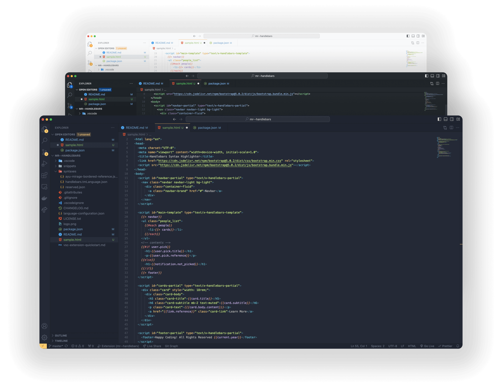

# Handlebars - Syntax Highlighter

Supercharge your development with Handlebars Syntax Highlighter! Enjoy syntax highlighting, enhanced code readability and Handlebars code snippets.

## Key Features
- Hightlights handlebars syntax
- Handlebars code snippets
- Enhanced code readability

## Snippets
| Trigger | Description | Code Generate |
| --- | --- | --- |
| `-template` | Generates 's template | ``|
| `-partial` | Generates handlebar's partial template | `` |
| `-layout` | Layout template | `{{#> layout}}{{/layout}}` |
| `-render` | Render partial template | `{{> mypartial}}` | 
| `-list` | List helper | `{{#list option-hash}}{{/list}}` |
| `-log` | Log helper | `{{#log 'log_something'}}` |
| `-if` | If condition | `{{#if foo}}{{/if}}` |
| `-ifelse` | If-Else condition | `{{#if foo}}{{else}}{{/if}}` |
| `-unless` | Unless condition | `{{#unless foo}}{{/unless}}` |
| `-with` | With helper | `{{#with object}}{{/with}}` |
| `-each` | Each helper | `{{#each object}}{{/each}}` |
---
For feature request and bugs report, submit issue on this [repository](https://github.com/CarlSaqui29/HandlebarsSyntaxHighlighter/issues). Si Vis Pacem, Para Bellum.
